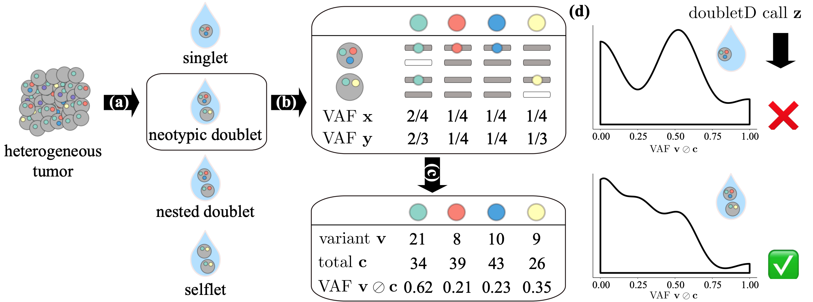

# doubletD

[](https://anaconda.org/bioconda/doubletd)
[](http://bioconda.github.io/recipes/doubletd/README.html)


(a) The first step of most single-cell sequencing technologies involves cell capture where the goal is to encapsulate single cells into droplets, known as *singlets*.
However, errors in this process can lead to three kind of doublets -- *neotypic* doublets, *nested* doublets and *selflets*.
(b) The cells in each isolated droplet *i* undergo whole-genome amplification and sequencing independently.
These processes introduce errors such as allelic dropouts and imbalance in amplification.
(c) The resulting aligned reads are used for variant calling yielding alternate v_{i,j} and total c_{i,j} read counts at each locus of interest *j*.
(d) doubletD uses the observed variant allele frequencies v_{i,j}/c_{i,j} as the key signal, while accounting for sequencing and amplification errors to detect doublets in the sample.

## Contents

  1. [Installation](#install)
     * [Using conda](#conda)(recommended)
     * [Using pip](#compilation) (alternative)
          * [Dependencies](#pre-requisites)
          * [install using pip](#install)
  2. [Usage instructions](#usage)
     * [I/O formats](#io)
     * [doubletD](#doubletD)

<a name="install"></a>

## Installation

### Using conda (recommended) 

<a name="conda"></a>
  ```bash
  $ conda install -c bioconda doubletd
   ```

### Using pip (alternative)

<a name="pre-requisites"></a>
## Pre-requisites
+ python3 (>=3.6)
+ setuptools
+ [numpy](https://numpy.org/doc/)
+ [pandas](https://pandas.pydata.org/pandas-docs/stable/index.html)

<a name="install"></a>
  1. Clone the repository
      ```bash
            $ git clone https://github.com/elkebir-group/doubletD.git
        ```

  2. Install doubletD using pip
    
     ```bash
            $ cd doubletD
        `   $ pip install ./
      ```
<a name="usage"></a>
## Usage instructions

<a name="io"></a>
### I/O formats
The input for doubletD is a text based with two input comma-separated dataframes -- one containing the total read counts and another containing the alternate read counts.
For both the files, each row is a different droplet and each column is a loci.
See `data/sample_DP.tsv` and `data/sample_AD.tsv` for an example for both files.
The output is also a dataframe with each row for a different droplet and columns, from left to right, posterior probability that the droplet is a singlet, posterior probability that the droplet is a doublet and prediction for the droplet to be either 'singlet' or 'doublet'.
See `data/sample_prediction.tsv` for an example.

### Arguments

Parameters with default value `None` are estimated from data

    usage: doubletd [-h] [--inputTotal INPUTTOTAL]
                   [--inputAlternate INPUTALTERNATE] [--delta DELTA]
                   [--beta BETA] [--mu_hetero MU_HETERO] [--mu_hom MU_HOM]
                   [--alpha_fp ALPHA_FP] [--alpha_fn ALPHA_FN] [-o OUTPUTFILE]
                   [--noverbose] [--binomial] [--prec PREC] [--missing]
      optional arguments:
        -h, --help            show this help message and exit
        --inputTotal INPUTTOTAL
                              csv file with a table of total read counts for each
                              position in each cell
        --inputAlternate INPUTALTERNATE
                              csv file with a table of alternate read counts for
                              each position in each cell
        --delta DELTA         expected doublet rate [0.1]
        --beta BETA           allelic dropout (ADO) rate [0.05]
        --mu_hetero MU_HETERO
                              heterozygous mutation rate [None]
        --mu_hom MU_HOM       homozygous mutation rate [None]
        --alpha_fp ALPHA_FP   copy false positive error rate [None]
        --alpha_fn ALPHA_FN   copy false negative error rate [None]
        -o OUTPUTFILE, --outputfile OUTPUTFILE
                              output file name
        --noverbose           do not output statements from internal solvers
                              [default is false]
        --binomial            use binomial distribution for read count model
                              [default is false]
        --prec PREC           precision for beta-binomial distribution [None]
        --missing             use missing data in the model? [No]


### Example

Here we will show an example of how to run `doubletD`.
The input files are located in the `example` directory.
We run `doubletD` with a prior doublet probabiltity of 0.2 and ADO rate of 0.05 without using missing data in our model.

    $ doubletd --inputAlternate example/AD.csv --inputTotal example/DP.csv --delta 0.2 --beta 0.05 -o example/prediction.tsv 

This command generates output file `prediction.tsv` in directory `example`.
